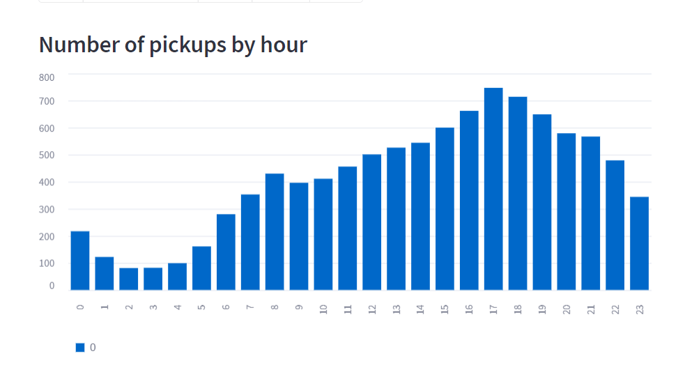

# 創建一個應用程序

* 目標: 使用 Streamlit 的核心功能來創建交互式應用程序，探索紐約市接送服務的公共優步數據集。
* 將知道如何獲取和緩存數據、繪製圖表、在地圖上繪製信息以及使用交互式小部件（如滑塊）來過濾結果。

## 創建應用程序

建立 Python 腳本: [`under_pickups.py`](./under_pickups.py)

## 獲取一些數據

1. 編寫一個函數來加載數據(加上**緩存**)。將此代碼添加到您的腳本中:
    (比較有無緩存，可以發現下載數據時間差異很大)


    ```python
    DATE_COLUMN = 'date/time'
    DATA_URL = ('https://s3-us-west-2.amazonaws.com/'
            'streamlit-demo-data/uber-raw-data-sep14.csv.gz')

    @st.cache_data
    def load_data(nrows):
        data = pd.read_csv(DATA_URL, nrows=nrows)
        lowercase = lambda x: str(x).lower()
        data.rename(lowercase, axis='columns', inplace=True)
        data[DATE_COLUMN] = pd.to_datetime(data[DATE_COLUMN])
        return data
    ```

    當您使用 Streamlit 的緩存註解標記一個函數時，它會告訴 Streamlit，無論何時調用該函數，它都應該檢查兩件事：
    * 您用於函數調用的輸入參數。
    * 函數內的代碼。

    如果這是 Streamlit 第一次看到這兩個項目，具有這些確切的值，並且在這個確切的組合中，它會運行該函數並將結果存儲在本地緩存中。下次調用該函數時，如果這兩個值沒有改變，則 Streamlit 知道它可以完全跳過執行該函數。相反，它從本地緩存讀取輸出並將其傳遞給調用者——就像變魔術一樣。

2. 測試函數並查看輸出:

    ```python
    # Create a text element and let the reader know the data is loading.
    data_load_state = st.text('Loading data...')
    # Load 10,000 rows of data into the dataframe.
    data = load_data(10000)
    # Notify the reader that the data was successfully loaded.
    data_load_state.text('Loading data...done!')
    ```

## 檢查原始數據
在開始使用原始數據之前，最好先查看一下您正在使用的原始數據。讓我們向應用程序添加一個子標題和原始數據的打印輸出:

```python
st.subheader('Raw data')
st.write(data)
```


## 繪製直方圖
**直方圖與 Uber 的數據集一起使用可以幫助我們確定什麼時候最繁忙的接送時間**

```python
# 繪製直方圖
st.subheader('Number of pickups by hour')

# 使用 NumPy 生成一個直方圖，該直方圖按小時劃分取件時間:
hist_values = np.histogram(
    data[DATE_COLUMN].dt.hour, bins=24, range=(0,24))[0]

st.bar_chart(hist_values)
```



## 在地圖上繪製數據
* **顯示 Uber 接送位置**
* **顯示巔峰時間 Uber 接送位置**

```python
# 在地圖上繪製數據
st.subheader('Map of all pickups')
st.map(data)

## 過濾巔峰時間的 Uber 接送位置
hour_to_filter = 17
filtered_data = data[data[DATE_COLUMN].dt.hour == hour_to_filter]
st.subheader(f'Map of all pickups at {hour_to_filter}:00')
st.map(filtered_data)
```


## 使用 Slider 過濾結果
在前一節中，我們過濾 Uber 巔峰時間的位置，現在我們想要讓使用者可以自己篩選數據:
當我們想讓讀者**實時動態篩選**數據，可以使用`st.slider()`:

```python
## 過濾巔峰時間的 Uber 接送位置
hour_to_filter = st.slider('hour', 0, 23, 17)  # min: 0h, max: 23h, default: 17h
filtered_data = data[data[DATE_COLUMN].dt.hour == hour_to_filter]
st.subheader(f'Map of all pickups at {hour_to_filter}:00')
st.map(filtered_data)
```


## 使用按鈕切換數據
滑塊只是動態更改應用程序組成的一種方式。讓我們使用該`st.checkbox`函數向您的應用程序添加一個複選框。我們將使用此復選框來**顯示/隱藏**應用程序頂部的原始數據表:

用以下代碼替代[檢查原始數據的代碼](#檢查原始數據):
```python
if st.checkbox('Show raw data'):
    st.subheader('Raw data')
    st.write(data)
```


## 分享應用程序
* 可以使用 Streamlit Community Cloud 免費部屬、管理和共享應用程序
* 它通過 3 個簡單的步驟工作：
    * 將您的應用程序放在公共 GitHub 存儲庫中（並確保它有一個 `requirements.txt`！）
    * 登錄[`share.streamlit.io`](https://share.streamlit.io/)
    * 單擊“部署應用程序”，然後粘貼您的 GitHub URL
    * 完成部屬[應用程序](https://lin-jun-xiang-streamlit-demo-under-pickups-beygga.streamlit.app/)